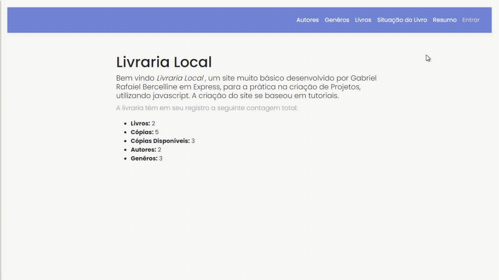

# livrariaLocal

Projeto densevolvido com auxilio de tutorias ( <a href="https://developer.mozilla.org/pt-BR/docs/Learn/Server-side/Express_Nodejs"> MDN Express</a>, <a href="https://www.udemy.com/course/curso-de-javascript-moderno-do-basico-ao-avancado/#instructor-1"> Curso JS </a> ). 
Modificado com intuito de aprendar as tecnologias contidas nele.

 

